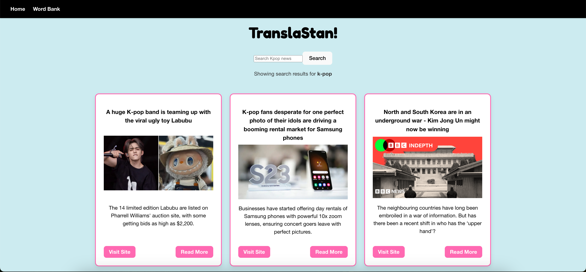
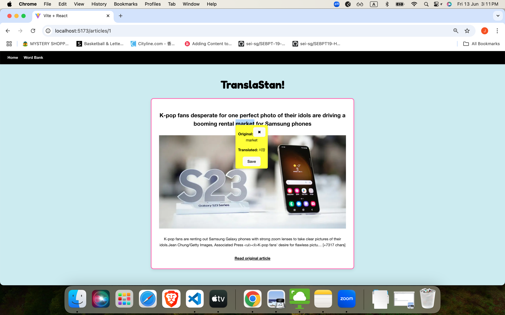
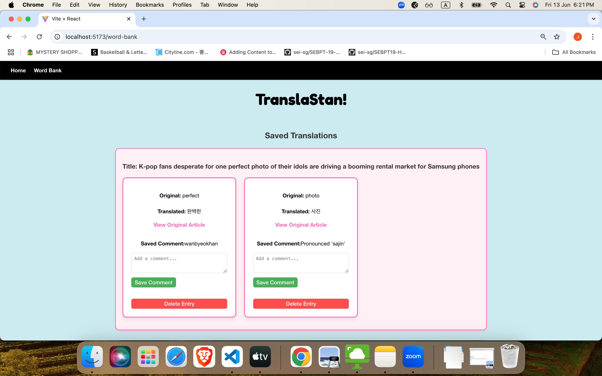

# TranslaStan!

## Inspiration 
Inspired by my coworker's passion for Blackpink and my own connection with Carats from Project 1, combined with my knowledge of Korean, I wanted to build a project that blends education with the excitement and fun of fan culture. The goal was to create something both informative and engaging for fans learning the language through their favorite artists.

## Screenshots

### Home Screen

### Article Screen with Translation Capability

### Word Bank 

## Technologies Used
- React
- CSS
- Javascript
- [NewsAPI](https://newsapi.org/)
- [Lingva (translation API)](https://lingva.ml/)

## Links 🔗

- [Presentation](https://www.canva.com/design/DAGp9Ge5w1E/IDCOfqH21V8hDKDo-oSNDA/edit)

## Acknowledgements
- ChatGPT for helping with my CSS Styling

## Roadmap
- Extractor API to extract full text

